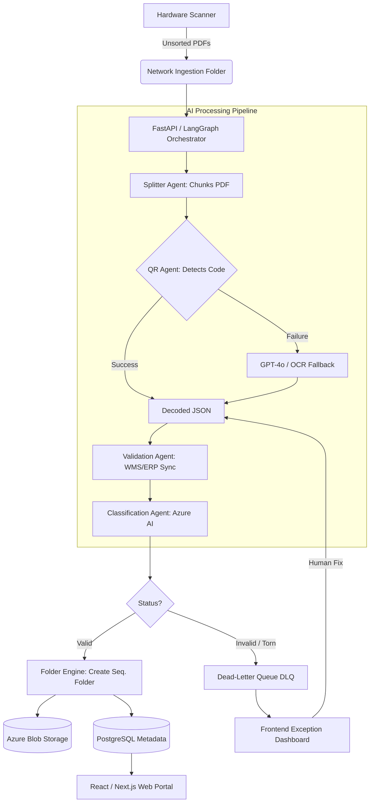

# Production Handover Report: AI-Powered Intelligent Document Processing (IDP) Platform

**Date:** August 19, 2026  
**Project:** AI-Powered Intelligent Document Processing & QR-Based Automation  
**Prepared For:** Main IT Team / Production Deployment  

---

## 1. Executive Summary

The **AI-Powered Intelligent Document Processing (IDP) Platform** is designed to automate the complete lifecycle of warehouse document processing for EFL Global. Currently, high volumes of containers are processed daily, each accompanied by a Gate Pass and supporting documents (Invoices, Packing Lists, Customs Documents, etc.). 

This architectural upgrade introduces a **QR Code-Based Gate Pass Processing layer**. The AI agents automatically detect, read, and validate QR codes on Gate Passes, utilizing the QR data as a digital key that connects physical warehouse documents to the enterprise system. This system guarantees near-perfect accuracy in container matching, automated folder generation, and real-time website synchronization, eliminating the errors associated with manual document sorting and folder naming.

---

## 2. System Architecture & Data Flow

The system is designed as a highly scalable micro-agent architecture, built primarily in Python using a state machine paradigm for orchestration.

### 2.1 Visual Data Flow Diagram
Below is the architectural flow of how data moves from physical paper to the cloud database.



### 2.2 Core Technologies
- **Backend & API:** FastAPI (Python)
- **AI Orchestration:** LangGraph Agent (State Machine Logic)
- **QR Detection & Decoding:** OpenCV, ZBar / pyzbar
- **AI Vision Fallback:** GPT-4o Vision / Azure AI Vision
- **Core OCR & Classification:** Azure Document Intelligence
- **Database:** PostgreSQL (with JSONB columns for dynamic metadata) & SQLite for local/testing. Redis is used for task queues.
- **Storage:** Azure Blob Storage
- **Deployment & Containerization:** Docker & Docker Compose
- **Frontend Portal:** React/Next.js (Premium dark theme web portal)

---

## 3. Database Schema Reference

For the IT Database Administrators, the primary source of truth for the application state is stored in the PostgreSQL database under the `document_processes` table. 

**Table: `document_processes`**
| Column | Type | Description |
| :--- | :--- | :--- |
| `id` | String (PK) | Unique LangGraph processing ID. |
| `gate_pass_no` | String (Indexed) | Extracted Gate Pass Number (Primary search key). |
| `container_no` | String (Indexed) | Extracted Container Number (Primary search key). |
| `status` | String | Current pipeline state (e.g., PENDING, SUCCESS, FAILED). |
| `folder_path` | String | The exact Azure Blob Storage URI where the generated folder lives. |
| `extracted_data` | JSONB | Raw, flexible storage for all dynamically extracted data. |
| `validation_status` | JSONB | Stores warnings if WMS/ERP syncing fails. |
| `created_at` / `updated_at` | DateTime | Timestamps for processing metrics. |

---

## 4. The Fully Automated AI Process (End-to-End Workflow)

To understand exactly how the system operates in real-time without human intervention, here is the complete lifecycle of a document batch:

1. **Physical Scanning:** A warehouse operator takes a massive stack of mixed documents (containing multiple Gate Passes, Invoices, and Packing Lists for different containers) and feeds them into the hardware scanner. The scanner drops a massive, unsorted PDF into the network ingestion folder.
2. **AI Splitting (Computer Vision):** The `Intake Agent` detects the new file. The `Splitter Agent` uses visual heuristics and AI to automatically cut the massive PDF into logical chunks, separating documents so that each chunk belongs to one specific Container.
3. **QR Detection & AI Reading:** The `QR Agent` takes over, scanning the first page of each chunk to locate the Gate Pass QR code. It instantly decodes the Gate Pass Number and Container ID. If the QR code is smudged, it automatically falls back to an AI regex/OCR scan of the text.
4. **Cloud Validation:** The `Validation Agent` takes the extracted Container ID and pings the central EFL WMS/ERP database API to ensure this container is active and expected today.
5. **Smart Document Sequencing:** The `Classification Agent` sends the remaining pages to Azure Document Intelligence. The AI reads every page, understands what type of document it is (e.g., "This is an Invoice", "This is a Customs form"), and physically re-orders the PDF pages so the Gate Pass is always page 1, followed logically by supporting docs.
6. **Digital Archiving:** The `Folder Engine` automatically creates a perfectly named directory in Azure Blob Storage (e.g., `2026-08-19_Container-MSKU1234567_GP-98765/`) and saves the metadata as JSON.
7. **Real-time UI Sync:** Within seconds of the physical scan finishing, the structured data appears instantly on the Web Portal's Master Dashboard, fully searchable and organized, with no manual data entry required.

---

## 5. Frontend UI & API Integrations

The platform features a modern, premium "deep dark" aesthetic with glowing elements, branded for "Logistics Park (Pvt) Limited" under the EFL GLOBAL IDP suite.

- **Master Data Grid & Container Dashboard:** For viewing high-level KPIs and real-time processing statistics.
- **Folder Explorer View:** Features a context-specific search bar allowing users to search by date/container details to quickly locate system-generated folders.
- **AI Assistant Chatbot:** An integrated system-aware RAG bot on the website that is linked to all system features. Users can ask questions about document statuses and system operations.
- **AI Report Generator:** A conversational UI allowing users to generate custom tabular reports (e.g., exception summaries, processing volume) using natural language prompts, exportable as CSV or PDF.
- **REST APIs & Security:** Secured via JWT/OAuth2. Webhooks and REST endpoints ensure documents can be queried via metadata seconds after scanning.

---

## 6. Deployment & Configuration Guide

The application is a purely **Cloud-Native & Infrastructure Agnostic** system. Because the entire system is containerized via Docker and uses SQLAlchemy for dynamic database dialect routing, **no core Python code needs to be modified to deploy to cloud hosting**. The code will run identically on a local laptop, an on-premise warehouse server, or an Oracle Cloud/Azure Virtual Machine. 

The following outlines the exact steps and configurations the IT team needs to manage the system.

### 6.1 Environment Variables (`.env`)
The system requires a `.env` file at the root directory to function. **These must be populated by the IT team before launching.**

```env
# Database & Cache
DATABASE_URL=postgresql://user:password@db:5432/efl_idp  # Override for prod
REDIS_URL=redis://redis:6379/0

# Azure Credentials for Cloud Storage & OCR
AZURE_DOCUMENT_INTELLIGENCE_ENDPOINT=https://your-endpoint.cognitiveservices.azure.com/
AZURE_DOCUMENT_INTELLIGENCE_KEY=your-azure-key
AZURE_STORAGE_CONNECTION_STRING=your-azure-storage-connection-string

# AI Model Credentials
GROQ_API_KEY=your-groq-key # Or OpenAI key if swapped
```

### 6.2 Required Infrastructure Permissions
To operate this system, the IT team must have administrative access to:
1. **GitHub Repository:** Full access to manage versions and pull requests.
2. **Azure Portal:** Access to the Azure Storage Accounts (Blob) and Azure AI Services (Document Intelligence) to manage keys and quotas.
3. **Production Server Host:** SSH access to the VM/Server hosting the Docker containers.

### 6.3 Complete Production Setup & Startup Commands

**Option A: Containerized Production Deployment (Recommended)**
This is the standard approach for the production server.

1. **Transfer the Source Code to the Production Server:**
   Take the physical `AI-Powered-Intelligent-Document-Processing-IDP-Platform` source code folder provided in this handover and copy it directly to the target production machine (via USB, SCP, or shared drive).

2. **Navigate into the directory:**
   Open a terminal/command prompt on the production machine and navigate into that folder:
   ```bash
   cd path/to/AI-Powered-Intelligent-Document-Processing-IDP-Platform
   ```
   *(Alternatively, if the server has Git access, you can run `git clone https://github.com/Thasmika/AI-Powered-Intelligent-Document-Processing-IDP-Platform.git`)*

3. **Start the infrastructure:**
   From inside the folder, run:
   ```bash
   docker-compose up -d --build
   ```
   *This command reads the local files and spins up the required PostgreSQL database, Redis task queue, and the FastAPI backend on port 8000.*

3. **Verify API & Database Health:**
   - Health Check Endpoint: `http://localhost:8000/health`
   - Swagger Documentation: `http://localhost:8000/docs`
   - Ensure the `efl_idp` database has automatically run its initialization scripts.

4. **Monitoring Logs:**
   To view real-time logs from the AI Agents and API, run:
   ```bash
   docker-compose logs -f api
   ```

**Option B: Local Development & Debugging Setup**
If the IT team needs to run the code locally to debug or add features without Docker.

1. **Create and activate a Python Virtual Environment:**
   ```bash
   python -m venv venv
   # On Windows:
   venv\Scripts\activate
   # On Mac/Linux:
   source venv/bin/activate
   ```

2. **Install core dependencies:**
   ```bash
   pip install -r requirements.txt
   ```
   *Note: Ensure system-level libraries for `pyzbar` (like `zbar-tools` on Linux or `zbar` via brew on Mac) are installed.*

3. **Start the backend locally:**
   ```bash
   uvicorn src.main:app --reload --port 8000
   ```

### 6.4 Frontend Access
The web portal (Dashboard, Explorer, Chatbot) is served via the static directory integrated within the FastAPI backend.
Once the system (Docker or Local) is running, simply navigate to `http://localhost:8000/` (or the production server's IP/Domain) in any modern web browser to access the fully functional frontend UI.

### 6.5 Oracle Cloud (OCI) & Oracle Database Integration

**Hosting on Oracle Cloud Infrastructure (OCI):**
If the IT team is deploying this system on an OCI Compute Instance (e.g., Oracle Linux or Ubuntu):
1. **VM Provisioning:** Spin up the compute instance and install Docker/Docker-Compose.
2. **Network Security:** Ensure that Port `8000` is opened in the **OCI Virtual Cloud Network (VCN) Security Lists** (Ingress Rules) so users can access the web portal externally.
3. Follow the exact Docker startup commands in Section 6.3.

**Swapping to an Oracle Database:**
The system defaults to PostgreSQL. If the enterprise requires connecting to an **Oracle Autonomous Database** or a standard Oracle DB instead:
1. **Install Driver:** Add the python driver to `requirements.txt` by adding the line `oracledb`.
2. **Update `.env` Connection String:** Change the `DATABASE_URL` to use the Oracle SQLAlchemy dialect:
   ```env
   DATABASE_URL=oracle+oracledb://db_user:db_password@db_host:db_port/?service_name=your_service_name
   ```
3. **Rebuild Container:** Run `docker-compose up -d --build` to ensure the new Oracle drivers are installed in the backend container before starting it.

---

## 7. Comprehensive Troubleshooting & System Maintenance

This section outlines common failure scenarios the IT team may encounter in production and exact steps to resolve them.

### 7.1 Scenario: Documents are stuck in the "Exception Dashboard" (DLQ)
**Symptom:** Physical documents were scanned, but they do not appear in the Master Container Dashboard. Instead, they appear in the Dead-Letter Queue (DLQ).
**Root Cause:** The physical Gate Pass had a torn, smudged, or completely unreadable QR code, AND the fallback regex text-extractor could not confidently determine the Container ID or Gate Pass ID from the raw PDF text.
**Fix/Resolution:** 
1. An operational staff member must log into the Web Portal and navigate to the "Exception Dashboard".
2. Click on the flagged document to open the visual PDF preview.
3. Manually read the Container Number and Gate Pass ID from the image and type them into the resolution form.
4. Click "Submit" to inject the document back into the LangGraph state machine for processing and folder generation.

### 7.2 Scenario: System slows down / Documents take minutes to process
**Symptom:** Scanning high volumes of documents results in a massive delay before they appear in the UI.
**Root Cause:** The Redis background worker queue is overwhelmed, or Azure Document Intelligence rate limits (429 errors) are being hit.
**Fix/Resolution:**
1. Check the Redis Queue depth: `docker exec -it <redis-container-id> redis-cli llen celery`
2. If the queue is massive, scale up the FastAPI background workers in the `docker-compose.yml` (e.g., `docker-compose up -d --scale worker=3`).
3. Check application logs (`docker-compose logs --tail=100 api`) for `429 Too Many Requests` errors from Azure. If found, upgrade the Azure AI Document Intelligence pricing tier in the Azure Portal to allow higher Transactions Per Second (TPS).

### 7.3 Scenario: "pyzbar.pyzbar.PyZbarError: ZBar library not found"
**Symptom:** The API crashes or logs show errors immediately upon receiving a PDF, specifically mentioning `pyzbar` or `zbar`.
**Root Cause:** The underlying C-library `zbar` is missing from the host operating system. This is common if running locally without Docker.
**Fix/Resolution:**
- If running natively on Linux (Ubuntu/Debian): Run `sudo apt-get install libzbar0`.
- If running natively on macOS: Run `brew install zbar`.
- Note: This issue will *not* occur if using the provided Docker image, as it installs `libzbar0` automatically.

### 7.4 Scenario: Database Connection Errors / Migrations Failing
**Symptom:** The backend container restarts repeatedly or throws `sqlalchemy.exc.OperationalError: FATAL: password authentication failed for user`.
**Root Cause:** Mismatch in the `.env` database credentials versus the `docker-compose.yml` Postgres initialization.
**Fix/Resolution:**
1. Verify that `DATABASE_URL` in your `.env` perfectly matches the `POSTGRES_USER`, `POSTGRES_PASSWORD`, and `POSTGRES_DB` defined in `docker-compose.yml`.
2. If you changed the password in `.env` *after* running `docker-compose up` the first time, the Postgres volume already initialized with the old password. You must destroy the database volume (`docker-compose down -v`) and restart (NOTE: This deletes all database data, only do this during initial setup!).

### 7.5 Routine Maintenance & Cost Drivers
- **Database Backups:** The actual PDFs are safely stored in Azure Blob Storage, but metadata is in PostgreSQL. Ensure an automated daily backup routine is implemented for the PostgreSQL `efl_idp` database volume using `pg_dump`.
- **Blob Storage Lifecycle Policies:** Set up an Azure Blob Storage lifecycle policy to automatically move PDFs older than 5 years (or per company retention policy) to Cold/Archive storage to reduce cloud costs.
- **Third-Party Costs (Monitor Monthly):** Be aware of billing for Azure Document Intelligence (priced per page classified) and Groq/OpenAI APIs (priced per token during fallback OCR processes).

---

## 8. Implementation Plan History

For context on how this system was originally designed and built, the following summarizes the phased implementation plan that was successfully executed during the development cycle.

### Phase 1: Core Architecture & Setup
- Set up the foundational Python FastAPI structure.
- Containerized the environment using `docker-compose.yml` to run PostgreSQL and Redis alongside the application.
- Initialized the PostgreSQL JSONB schema definition in `src/database/`.

### Phase 2: Ingestion & QR Code Engine Prototype
- Built `src/agents/intake_agent.py` to monitor simulated scanner input directories.
- Developed `src/agents/splitter_agent.py` to detect Gate Pass pages within large batched PDFs and split them logically per container.
- Implemented the core **QR Code Recognition Agent** (`src/agents/qr_agent.py`) utilizing OpenCV and `pyzbar` to decode JSON payloads directly from Gate Passes, including regex text-extraction fallbacks.

### Phase 3: Validation & OCR NLP Classification
- Built `src/agents/validation_agent.py` to cross-reference extracted QR metadata against central WMS/ERP databases for truth validation.
- Implemented `src/agents/classification_agent.py` utilizing Azure Document Intelligence to strictly classify all supporting documents (Invoices, Packing Lists) and sequence them appropriately.

### Phase 4: LangGraph AI Orchestration
- Connected the micro-agents using a LangGraph state machine (`src/agents/graph.py`).
- Implemented the Dead-Letter Queue (DLQ) edge case routing, ensuring any failed validations are pushed to a human-in-the-loop dashboard rather than silently dropping.
- Developed the `folder_engine.py` script to physically copy, rename, and generate the strictly formatted `YYYY-MM-DD_Container-[ContainerNumber]_GP-[GatePassID]/` output folders.

### Phase 5: REST API & Premium Frontend Portal
- Developed secured API endpoints (`src/api/routes.py`) to expose document metadata to the frontend.
- Built a modern, premium "deep dark" UI featuring:
  - The Container Dashboard Master View.
  - A responsive Folder Explorer with custom search functionality.
  - The Exception Dashboard for DLQ resolution.
  - A fully integrated, system-aware AI Assistant Chatbot and an AI Report Generator.

### Phase 6: Final Testing & UAT
- Ran unit tests specifically on `qr_agent.py` parsing capabilities.
- Conducted full pipeline tests on mock batches to verify the exact chronological generation of `01_GatePass.pdf`, `02_Invoice.pdf`, etc., prior to production handover.

---
*Built and successfully tested for EFL Global.*
